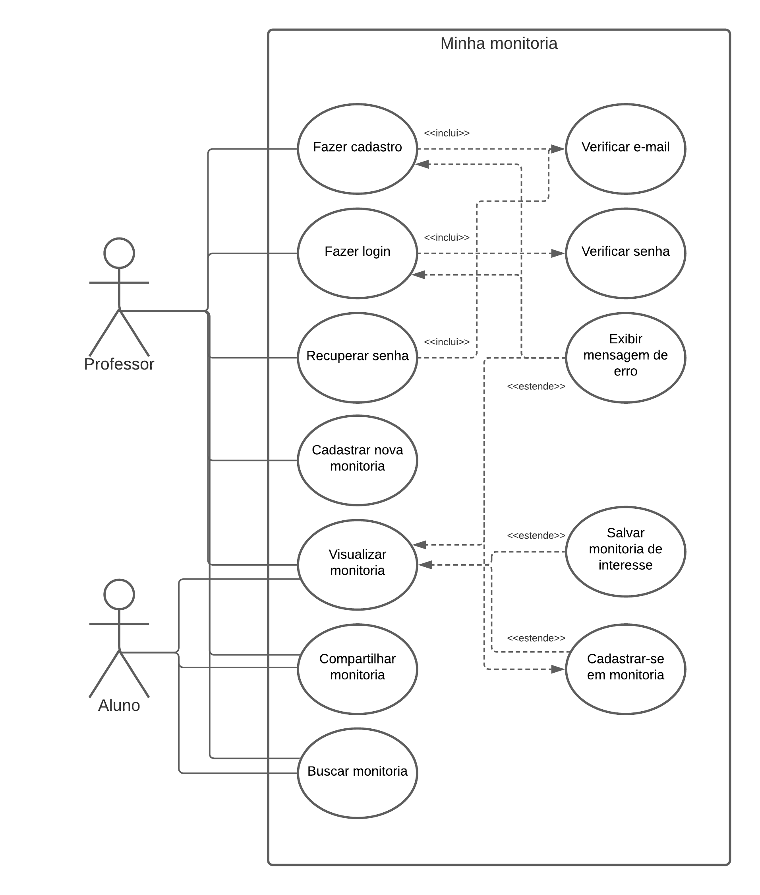

# Especificação de Casos de Uso

## Atores

|Nome|Descrição|
|:--:|:--:|
| Professor | Uma pessoa que pode visualizar, buscar e cadastrar nova monitorias |
| Aluno | Uma pessoa que pode visualizar, buscar e se cadastrar em monitorias existentes |

## Casos de uso

|Nome|Descrição|Atores|Prioridade|
|:--:|:--:|:--:|:--:|
| Fazer cadastro | Permitir que o usuário realize o cadastro no site com seu email | Professor | alta |
| Fazer login | Permitir que o usuário acesse o seu cadastro | Professor | alta |
| Recuperar senha | Permitir que o usuário recupere o acesso ao seu cadastro | Professor | alta |
| Cadastrar nova monitoria | Permitir que o usuário cadastre novas monitorias  | Professor | alta |
| Visualizar monitoria | Permitir que o usuário visualize as vagas de monitoria cadastradas | Aluno, Professor | alta |
| Compartilhar monitoria | Permitir que o usuário compartilhe em redes sociais as vagas de monitorias cadastradas | Aluno, Professor | baixa |
| Buscar monitoria | Permitir que o usuário busque por vagas de monitorias cadastradas no site | Aluno, Professor | média |

## Diagrama de Casos de Uso

